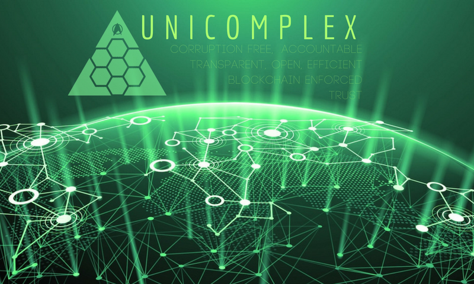
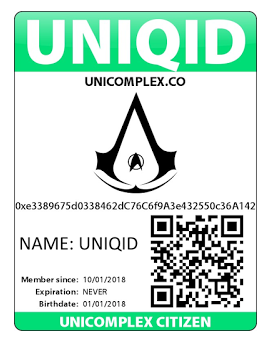
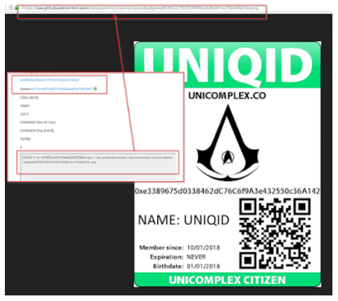

# UNICOMPLEX
corruption free - open - transparent and accountable governance 

# VISION

* To create a framework for corruption free governance incorporating true accountability driven by blockchain triple ledger technology, direct democracy and transparency.

* To provide additional value-adds by offering a sense of identity, security and durability.

## CONTRIBUTIONS

I will consider commits, please give full justifation as to why you believe it should be included/changed/removed. Please ensure empirical data is provided to susbstaniate your commits. 

# INTRODUCTION

The purpose of the ICO Coin (Unicoin) is to create a currency for the Unicomplex e-Citizen Open-Governance project which intends to utilize the triple-entry accounting power of the blockchain to create the world's first governance system designed from the ground up to be economically viable, sustainable and corruption free.

The same trust and protection that prevents people from creating fake BitCoin (BTC) will be leveraged to create a completely open and free direct democracy.  This form of governance will be built with checks and balances as part of its fundamental makeup to ensure there are no opportunities for unaccountable transactions/corrupt activities.

The system is designed to be open source, replicable and durable.  The decentralization of power has been specifically engineered to prevent population/civilization cascade failures and abuses of power.

All changes and updates, including topographical updates to governance structures and best practice documents will be uploaded to free, open source websites so that people can create their own local government cantons/masternodes.

The UniCoin will be the official currency of the UniComplex and will always be accepted as currency to pay for any UniComplex value added services.  Beyond providing structure for UniComplex services, this will help to ensure long-term value.

## UNICOMPLEX GOVERNANCE

* Building your identity, protecting your assets and enforcing trust with the blockchain and its triple-entry accounting.

* Corruption-free, transparent governance with trust enforced by the blockchain.

No matter how good human intention is, wealth and power corrupt.

Statement from the project architect, David Viaene:

> “I am both a hacktivist and a politician, for the same reasons.  I hate injustice and abuse and the bizarre insanity that is called reality.  I became a politician because I honestly believe that if we worked hard enough, if we tried hard enough; we could fix our civilization.
>
> I was about a week into my new job as a politician, working hard to make my community a better place when reality hit me like a steam train.  Nice guys do not finish first in politics.  The entire system is design for Machiavellians to win, and to either corrupt nice people or grind them into oblivion.
>
> No matter how hard I worked to try to fix our governance, human fallibility would always undo that work.  In politics, no good deed goes unpunished.  With a sinking feeling I realized ... I couldn't fix government.
>
> My recent discovery of the power of triple entry accounting and my new knowledge of the blockchain has renewed my hope.  I realize the blockchain has the power to create corruption free governance; something humanity has never had before.  It would remove all the shadows for lies to hide in.
>
> They often ask you when you do an ICO launch, ‘What problem does your product solve?’.  My answer, ‘Most of them’_

Every vote, every cent spent by the Unicomplex on governance, every decision made, every contract approved shall be tendered and recorded transparently on the blockchain.

Your vote is connected directly to your bio and UNIQID to guard against the possibility of fake votes.

In the Unicomplex, the power of your vote is enforced by the blockchain.  Geographic areas will be designated into decentralized, “canton” nodes for local governance voting.

### AIMS

To
* create a post-state trusted identity in a world with declining inter-entity trust and increasingly porous geographical borders;
with this sense of identity to be built on the blockchain to prevent fraud and corruption
* link trusted identity to asset ownership (company, property, crypto, information)
* build a fair, direct local governance system which utilizes the blockchain as much as possible to prevent corruption
* create a threat management system to protect Unicomplex citizens from bots, virus endpoint infection, cat phishing and other malicious actions
* focus on protecting the hearts and minds of Unicomplex citizens
* build contracts and associations with existing threat management networks to protect Unicomplex citizens and their assets.

## UNIQ ID

THE FOLLOWING IS AN ACTUAL SMART CONTRACT ID RECENTLY RUN FOR CONCEPT TESTING

https://etherscan.io/address/0xe3389675d0338462dc76c6f9a3e432550c36a142#code

The first smart contract for a name reservation on the ETH blockchain for: UNIQID

Images have also been able to be committed via Github to the blockchain.

A proof of concept was created by taking the ID above, uploading it to Github, and then committing that image to the blockchain (permanently).

This is an identity address token; which also gives its owner voting rights within the Unicomplex.

## PUBLIC DATA

Photo ID Card with:
scanable QR Code
public Unicomplex issued PGP key
encrypted smart chip hardwallet

with the following public crypto UNIQ data:

UNIQID: xxxxxxx

### OPTIONAL PUBLIC DATA CONTACT DATA

* Physical Address
* Postal Address
* Email 1
* Email Public/private PGP key
* Email 2
* Facebook Profile
* Twitter Profile
* Instagram Profile
* LinkedIn Profile
* Github Profile
* Matrix Profile
* Other Profiles
* Mobile
* Voice Contact
* Cryptocurrency Wallets

### PRIVATE DATA BIO DATA

* Date of Birth - with a copy of confirming documentation
* 3D Photo identification
* Location of birth
* Current ID/SS/Passport information
* Name at Birth
* Parents Names/ID
* DNA Signature and Blood type
* Iris Biometric Data
* Finger and hand print Biometric Data
* Dental record data
* Public/private PGP key

Anonymous DNA medical IDs will also be created so that citizens’ medical information can be listed with DNA and medical databases without their identity being compromised by those searching for victims matching your DNA/Blood type.

Multiple (verified) anonymous IDs should be a design in the system as well.  Users of these anonymous IDs would be able to submit verification without giving over personal data.  Users would be issued a single-use anonymous ID (attached to their UNIQID) to be used with untrustworthy vendors/unverified contracts.  These IDs would not be eligible for voting.

# UNICOMPLEX LEADERSHIP

## Unicomplex Council

* As the highest UniComplex authority, leadership comprises 5 (five) people.

* It is able to take binding votes and make binding decisions as long as these do not conflict with the core values and vision of the UniComplex.

* Leaders are rotated annually.

* A person may lead more than once, but not in consecutive terms and not more than twice.

## Federation Council

* This comprises one representative from every canton masternode on the network.

* The leaders are rotated annually.

* A person may lead more than once, but not in consecutive terms and not more than twice.

# UNICOMPLEX STRUCTURE

The Unimatrix is made up of masternodes known as cantons.  These will be connected together via federations into a network called the Unimatrix.

Canton/Master Nodes

These are the equivalent of “local government” which could be based on geography or shared ideals.

Voting for local government and issues that impact local government residents happens almost exclusively via this system and then is sent to UNICOMPLEX for archiving.

# UNICOMPLEX LAW ENFORCEMENT

This is not a function of the Unicomplex masternode.  It is a function delegated to canton masternodes on the network.

Every group and culture has its own set of rules and morality with which it lives.  Accordingly, this function is managed and enforced on the canton level.  This authority should never be centralized.

If a canton is voted to be working continuously against the spirit of the Unicomplex, and all remedial methods fail, a vote may be called by the Federation Council to determine whether or not to disconnect that masternode canton from the Unimatrix.

This should prevent tyranny of the mob. 

## THREAT MANAGEMENT

Currently under development in the Centaur project.

https://github.com/netsecdotml/centaurian/

# CURRENT STATUS

Concept is being finalized, A-team being built. Most dev work is currently happening in our centaurian units, as we will be using a centaurian unit to build the unicomplex with. Every day work is done in one form or another. 
